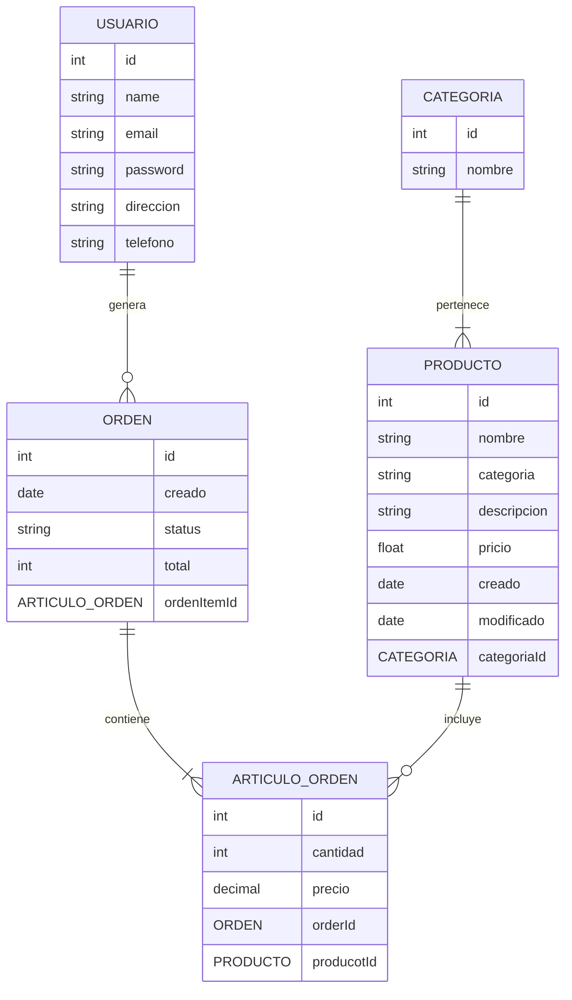

```mermaid
erDiagram
    USUARIO ||--o{ ORDEN : genera
    ORDEN ||--|{ ARTICULO_ORDEN : contiene    
    CATEGORIA ||--|{ PRODUCTO : pertenece
    PRODUCTO ||--o{ ARTICULO_ORDEN : incluye

    USUARIO {
        int id
        string name
        string email
        string password
        string direccion
        string telefono

    }

    ORDEN {
        int id
        date creado
        string status
        int total
        ARTICULO_ORDEN ordenItemId
    }


    ARTICULO_ORDEN{
    int id
    int cantidad
    decimal precio
    ORDEN orderId
    PRODUCTO producotId
    }
  

    PRODUCTO {
        int id
        string nombre
        string categoria
        string descripcion
        float pricio
        date creado
        date modificado
        CATEGORIA categoriaId
    }

    CATEGORIA {
        int id
        string nombre
    }
```
